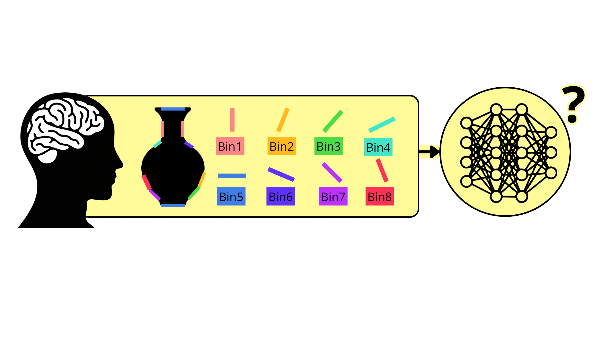
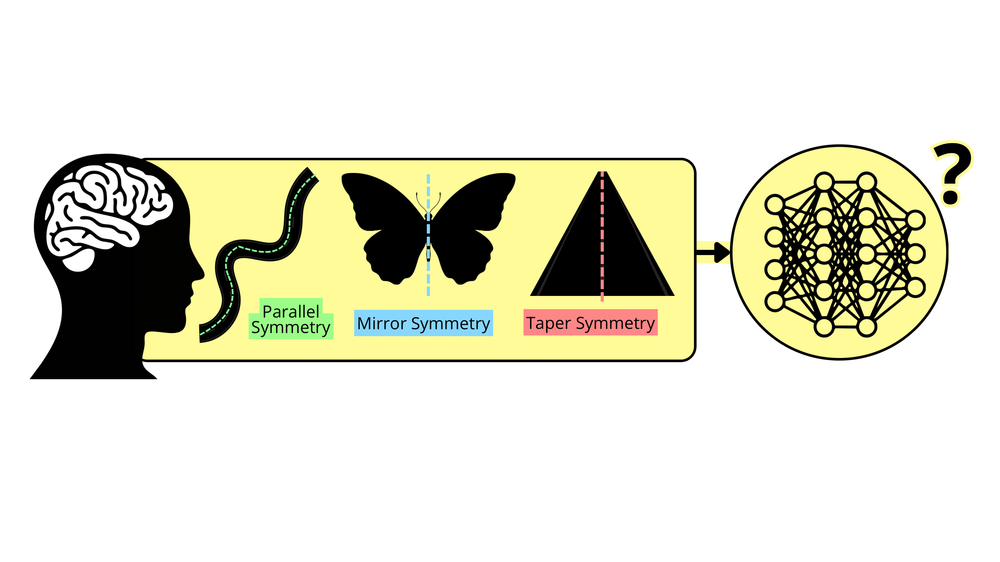

<div align="center">

<br>

<!-- Header badge row -->


<br><br>

<!-- # ContourFeatures in CNN -->
<div align="center">
  
</div>

### Orientation & Symmetry Analysis of Visual Representations

*Investigating how convolutional neural networks encode fundamental perceptual principles across 73,000 natural images*

<br>

[](docs/rop_poster.pdf)

<br>

---

</div>

## Project Overview

This repository contains the official codebase for a research project conducted at the **BWLab, University of Toronto**, investigating how CNNs encode fundamental perceptual principles. We analyze internal representations of **VGG16** across **73,000 natural images** from the Natural Scenes Dataset (NSD), focusing on two core visual properties.

<br>

<table width="100%">
<tr>
<td width="50%" valign="top">

### Orientation Analysis

<br><br>

We study how CNN feature maps encode **orientation information** across layers.

**Layers analyzed:**
- `CONV1-1` — 64 channels
- `CONV5-3` — 512 channels

**Compared against:**
| Pipeline | Description |
|----------|-------------|
| Contour | Edge-based orientation |
| Line drawing | Sketch-like representation |
| Photo | Raw photographic input |

**Method:** Pearson correlation across 180° orientation bins

</td>
<td width="50%" valign="top">

### Symmetry Analysis

<br><br>

We investigate whether CNNs capture **symmetry-related structure** in natural scenes.

**Coverage:** All convolutional layers of VGG16

**Symmetry types examined:**
| Type | Description |
|------|-------------|
| Contour | Boundary-based symmetry |
| Medial-axis | Skeleton symmetry |
| Area-based | Region symmetry |

**Structures tested:** Parallel · Mirror · Taper

**Method:** Hierarchical (nested) regression — measuring **ΔR² contribution** of symmetry features

</td>
</tr>
</table>

<br>

---

## Installation & Setup

### 1 · Clone the repository

```bash
git clone https://github.com/yourusername/ContourFeatures-in-CNN.git
cd ContourFeatures-in-CNN
```

### 2 · Install dependencies

```bash
pip install -r requirements.txt
```

### 3 · Prepare the dataset

Place the Natural Scenes Dataset (NSD) files under the `data/` directory:

```
ContourFeatures-in-CNN/
└── data/
    └── nsd/          ← NSD files go here
```

> 💡 Download NSD from [naturalscenesdataset.org](https://naturalscenesdataset.org/)

<br>

---

## References

- Allen, E. J., et al. (2022). A massive 7T fMRI dataset to bridge cognitive neuroscience and artificial intelligence. Nature Neuroscience. → https://naturalscenesdataset.org/
- Simonyan, K., & Zisserman, A. (2015). Very Deep Convolutional Networks for Large-Scale Image Recognition. ICLR.
- Bernhardt-Walther Lab (University of Toronto). (n.d.). MLV Toolbox. GitHub repository. → https://github.com/bwlabToronto/MLV_toolbox

<br>

---

## Affiliation

<div align="center">

Conducted at the **[BWLab, University of Toronto](https://www.bwlab.org/)**


</div>

<br>

---

<div align="center">


</div>
